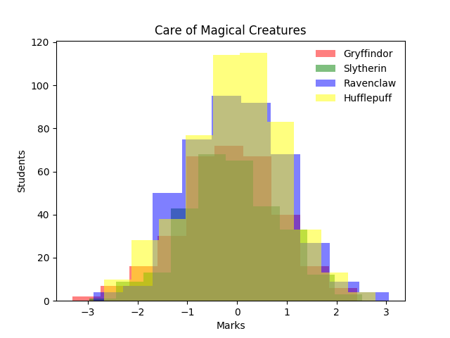
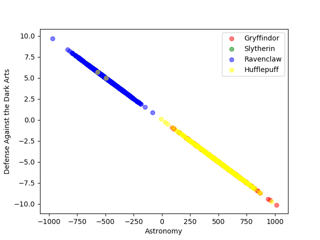
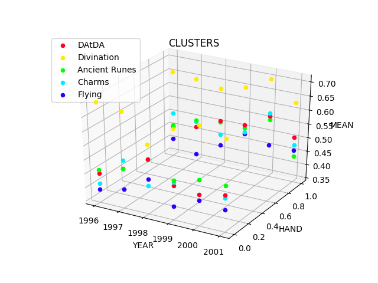
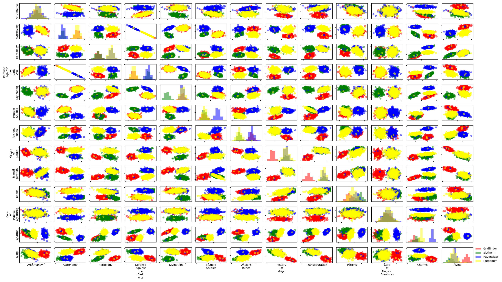
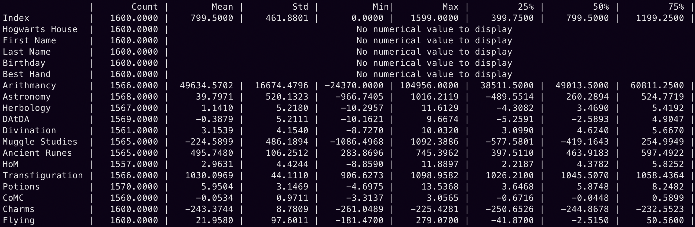
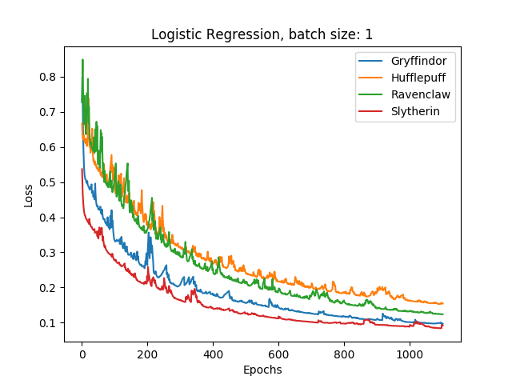
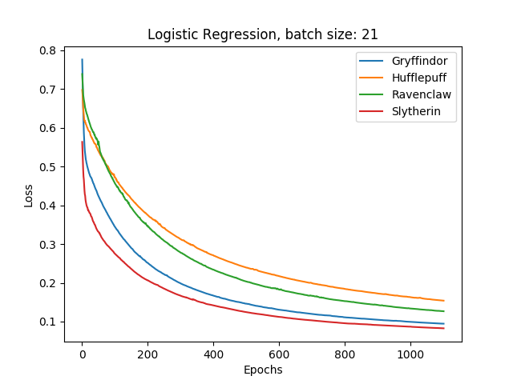
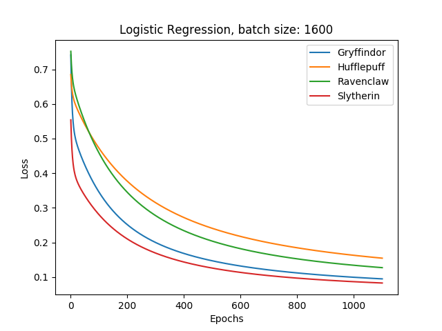

# DSLR
DataScience x Logistic Regression - School-42 project

#### Goals:
* Learn how to read a dataset, to visualize it in different ways, to select and clean unnecessary information from your data.
* Implement one-vs-all logistic regression that will solve classification problem

Look at [subject.pdf](readme_images/subject.pdf) for more information

## Requirements:
* `Python 3`
* `PyTorch`
* `NumPy`
* `Pandas`
* `Matplotlib`

## Setup:
```
git clone https://github.com/Gleonett/DSLR.git
cd DSLR
pip3 install -r requirements.txt
```

## Get started:
For information about arguments each executable has `-h` flag

### Data description
This are some visualization utils for dataset:
 
|[histogram.py](data_description/histogram.py)|[scatter_plot.py](data_description/scatter_plot.py)    |[clusters_3d_plot.py](data_description/clusters_3d_plot.py)|
|---------------------------------------------|-------------------------------------------------------|-----------------------------------------------------------|
|    |        |          |
| Show course marks distribution              |Show values for two courses using Cartesian coordinates|3D scatter plot of clusters                                |

|[pair_plot.py](data_description/pair_plot.py) is `scatter_plot.py` + `histogram.py` for all courses|
|---------------------------------------------------------------------------------------------------|
||

|[describe.py](data_description/describe.py) is implementation of [pandas.DataFrame.describe](https://pandas.pydata.org/pandas-docs/stable/reference/api/pandas.DataFrame.describe.html)|
|-------------------------------------------|
||
___

### Training and Evaluating:
`Accuracy` with standard parameters is `0.99`

Parameters for training, including batch size, are stored in [config.yaml](config.yaml)

* [logreg_train.py](logreg_train.py) saves `data/weights.pt`
(use `-v` flag for loss history visualization)

|stochastic GD                                    |                                             batch GD|                                                      GD|
|-------------------------------------------------|-----------------------------------------------------|--------------------------------------------------------|
||||

* [logreg_predict.py](logreg_predict.py) takes `data/weights.pt` and saves `data/houses.csv`
* [evaluate.py](evaluate.py) - `logreg_train.py` + `logreg_predict.py` and evaluating on `dataset_truth.csv`
* [random_evaluate.py](random_evaluate.py) - training and evaluating on random splitted `dataset_train.csv`
